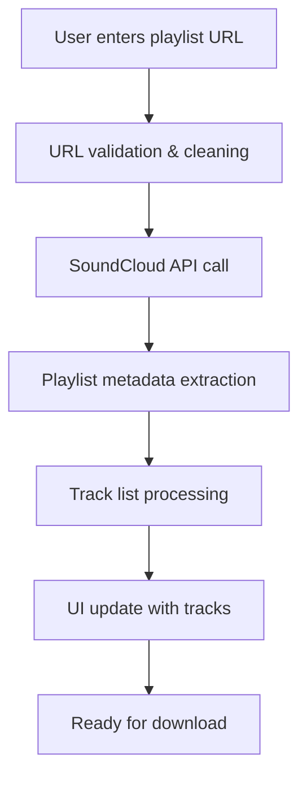
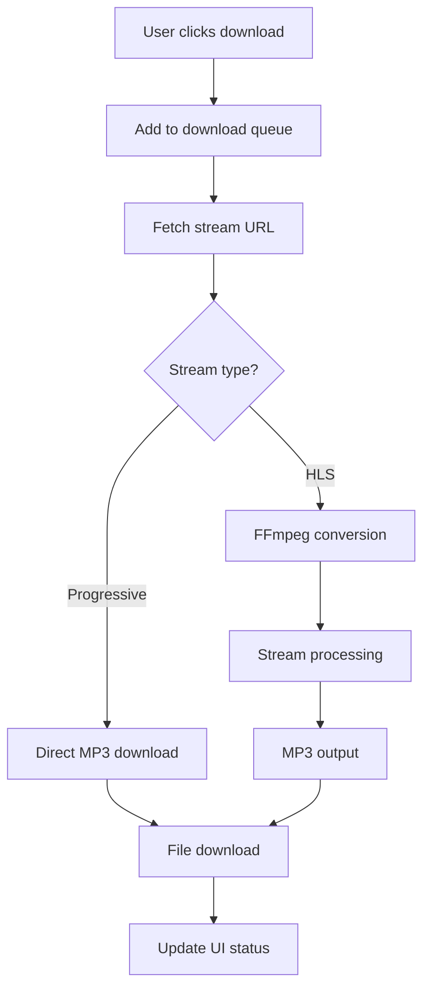

# SoundCloud Playlist Downloader

A modern, full-stack web application built with Nuxt 3 that allows users to download entire SoundCloud playlists as MP3 files. The application features a sleek UI, real-time download progress tracking, and robust error handling.

## 🎯 About This Project

This application solves the common problem of downloading multiple tracks from SoundCloud playlists by providing a streamlined, user-friendly interface. Users simply paste a SoundCloud playlist URL and can download individual tracks or entire playlists with a single click.

### Key Features

- **Playlist Processing**: Automatically extracts all tracks from SoundCloud playlists
- **Batch Downloads**: Download entire playlists or individual tracks
- **Real-time Progress**: Live download progress tracking with visual feedback
- **Audio Processing**: Converts HLS streams to MP3 using FFmpeg WebAssembly
- **Error Handling**: Robust retry mechanisms and user-friendly error messages
- **Performance Monitoring**: Built-in logging and performance tracking
- **Responsive Design**: Modern UI that works on desktop and mobile devices

## 🏗️ Architecture Overview

### Frontend Architecture (Vue 3 + Nuxt 3)

```
├── pages/
│   ├── index.vue          # Main playlist interface
│   └── track.vue          # Individual track page
├── components/
│   ├── PlaylistInput.vue  # URL input and validation
│   ├── TrackList.vue      # Track display and controls
│   ├── DownloadQueue.vue  # Download progress tracking
│   ├── LogsPanel.vue      # Debug and monitoring
│   └── PerformanceDashboard.vue
├── composables/
│   ├── usePlaylist.ts     # Playlist data fetching
│   ├── useTrackDownloader.ts # Download orchestration
│   ├── useAudioProcessor.ts  # FFmpeg audio processing
│   ├── useDownloadQueue.ts   # Queue management
│   └── useLogger.ts       # Logging and analytics
└── stores/
    └── [Pinia stores for state management]
```

### Backend Architecture (Nitro Server)

```
server/
├── api/
│   ├── playlist.ts        # Main playlist fetching endpoint
│   ├── stream-url.ts      # Stream URL resolution
│   ├── stream-mp3.ts      # MP3 streaming endpoint
│   ├── track-fallback.ts  # Fallback track resolution
│   └── health.ts          # Health check endpoint
└── utils/
    └── soundcloud.ts      # SoundCloud API utilities
```

## 🔄 Application Flow

### 1. Playlist Loading Flow



### 2. Download Flow



### 3. Data Flow Architecture

```
┌─────────────────┐    ┌──────────────────┐    ┌─────────────────┐
│   Frontend      │    │   Nitro Server   │    │   SoundCloud    │
│   (Vue/Nuxt)    │    │   (API Layer)    │    │   API           │
├─────────────────┤    ├──────────────��───┤    ├─────────────────┤
│ • User Input    │───▶│ • URL Processing │───▶│ • Playlist Data │
│ • UI Updates    │    │ • Data Transform │    │ • Track Metadata│
│ • Download Mgmt │    │ • Stream Resolve │    │ • Stream URLs   │
│ • Progress Track│◀───│ • Error Handling │◀───│ • Rate Limiting │
└─────────────────┘    └──────────────────┘    └─────────────────┘
```

## 🛠️ Technical Stack

### Core Technologies
- **Framework**: Nuxt 3 (Vue 3, TypeScript)
- **Styling**: Tailwind CSS + Nuxt UI
- **State Management**: Pinia
- **Audio Processing**: FFmpeg WebAssembly
- **HTTP Client**: Native Fetch API
- **Build Tool**: Vite

### Key Dependencies
- **soundcloud.ts**: SoundCloud API client
- **@ffmpeg/ffmpeg**: WebAssembly-based audio processing
- **howler**: Audio playback (if needed)
- **m3u8-parser**: HLS stream parsing

### Development Tools
- **TypeScript**: Full type safety
- **ESLint**: Code linting
- **Tailwind CSS**: Utility-first styling
- **Nuxt DevTools**: Development debugging

## 🎨 Design Patterns

### 1. Composables Pattern
The application heavily uses Vue 3 composables for reusable logic:

```typescript
// Example: useTrackDownloader composable
export const useTrackDownloader = () => {
  const downloadTrack = async (track: Track) => {
    // Download logic with error handling and progress tracking
  }
  
  return { downloadTrack, progress, error }
}
```

### 2. Queue Management Pattern
Downloads are managed through a sophisticated queue system:

```typescript
interface QueueItem {
  track: Track
  status: DownloadStatus
  progress: number
  error?: string
  retries?: number
}
```

### 3. Error Handling Strategy
- **Graceful Degradation**: Fallback mechanisms for failed requests
- **Retry Logic**: Exponential backoff for transient failures
- **User Feedback**: Clear error messages and recovery suggestions

### 4. Performance Optimization
- **Lazy Loading**: Components loaded on demand
- **Batch Processing**: Efficient handling of large playlists
- **Memory Management**: Proper cleanup of audio processing resources

## 🚀 API Design

### REST Endpoints

#### `GET /api/playlist?url={playlistUrl}`
Fetches playlist metadata and track information.

**Response:**
```json
{
  "playlistInfo": {
    "id": 123456,
    "title": "My Playlist",
    "description": "...",
    "artwork": "https://...",
    "tracksCount": 25
  },
  "tracks": [
    {
      "id": "789",
      "title": "Track Name",
      "artist": "Artist Name",
      "duration": 180000,
      "artwork": "https://...",
      "url": "https://soundcloud.com/...",
      "streamUrl": null
    }
  ]
}
```

#### `GET /api/stream-url?url={trackUrl}`
Resolves streaming URL for a specific track.

#### `GET /api/stream-mp3?url={streamUrl}`
Streams MP3 data for progressive downloads.

## 🔧 Configuration

### Environment Variables
```bash
# Optional: Custom SoundCloud client configuration
SOUNDCLOUD_CLIENT_ID=your_client_id
```

### Nuxt Configuration Highlights
- **CORS**: Enabled for API endpoints
- **WASM**: WebAssembly support for FFmpeg
- **Headers**: Security headers for cross-origin requests
- **Optimization**: Vite optimizations for large dependencies

## 📊 Performance Considerations

### Client-Side Optimizations
- **Code Splitting**: Automatic route-based splitting
- **Tree Shaking**: Unused code elimination
- **Asset Optimization**: Image and CSS optimization

### Server-Side Optimizations
- **Rate Limiting**: Prevents API abuse
- **Caching**: Strategic caching of playlist data
- **Timeout Handling**: Prevents hanging requests
- **Batch Processing**: Efficient track processing
- **Background Processing**: Handles large playlists without timeout limits

## 🔄 Background Processing System

For large playlists (>50 tracks), the application now supports background processing to avoid serverless timeout limits and provide better user experience.

### Architecture

```
┌─────────────────┐    ┌──────────────────┐    ┌─────────────────┐
│   Frontend      │    │   Job Queue      │    │   Background    │
│   (Vue/Nuxt)    │    │   (In-Memory)    │    │   Processor     │
├─────────────────┤    ├──────────────────┤    ├─────────────────┤
│ • Job Creation  │───▶│ • Queue Mgmt     │───▶│ • Playlist Proc │
│ • Progress UI   │    │ • Status Track   │    │ • Track Extract │
│ • Real-time     │◀───│ • Result Cache   │◀───│ • Error Handle │
│   Updates       │    │ • Cleanup        │    │ • Progress Rpt  │
└─────────────────┘    └──────────────────┘    └─────────────────┘
```

### Key Features

- **Unlimited Track Processing**: No artificial limits on playlist size
- **Real-time Progress Tracking**: Live updates with percentage completion
- **Automatic Retry Logic**: Built-in resilience for API failures
- **Concurrent Job Processing**: Configurable concurrency limits
- **Resource Management**: Intelligent batching and rate limiting
- **Job Persistence**: In-memory storage with automatic cleanup

### Usage

#### Frontend Integration
```vue
<template>
  <!-- Background processing toggle -->
  <label>
    <input v-model="useBackgroundProcessing" type="checkbox">
    Use background processing (recommended for large playlists)
  </label>
  
  <!-- Progress tracking -->
  <BackgroundJobProgress 
    v-if="currentJob"
    :job="currentJob"
    @close="closeJobProgress"
  />
</template>
```

#### API Endpoints

**Create Background Job:**
```bash
POST /api/jobs/create
Content-Type: application/json

{
  "type": "playlist",
  "url": "https://soundcloud.com/user/sets/large-playlist",
  "maxTracks": 200
}

Response:
{
  "success": true,
  "jobId": "job_1234567890_abc123",
  "status": "pending",
  "message": "Job created successfully. Processing will begin shortly.",
  "checkStatusUrl": "/api/jobs/status/job_1234567890_abc123"
}
```

**Check Job Status:**
```bash
GET /api/jobs/status/{jobId}

Response:
{
  "id": "job_1234567890_abc123",
  "type": "playlist",
  "status": "processing",
  "progress": 75,
  "createdAt": "2024-01-01T12:00:00Z",
  "updatedAt": "2024-01-01T12:05:00Z",
  "result": null  // Available when status is "completed"
}
```

**Get Job Statistics:**
```bash
GET /api/jobs/stats

Response:
{
  "success": true,
  "stats": {
    "total": 15,
    "pending": 2,
    "processing": 1,
    "completed": 10,
    "failed": 2,
    "processingCapacity": 3,
    "currentlyProcessing": 1
  }
}
```

#### Direct Playlist API with Background Processing
```bash
# Enable background processing
GET /api/playlist?url=PLAYLIST_URL&background=true&maxTracks=200

# Traditional processing (50 track limit)
GET /api/playlist?url=PLAYLIST_URL
```

### Job Lifecycle

1. **Creation**: Job added to queue with "pending" status
2. **Processing**: Job picked up by background processor
3. **Progress Updates**: Real-time progress reporting (0-100%)
4. **Completion**: Result stored and status updated to "completed"
5. **Cleanup**: Automatic cleanup after 1 hour

### Configuration

```typescript
// Job queue configuration
const jobQueue = new JobQueue({
  maxConcurrentJobs: 3,        // Process up to 3 jobs simultaneously
  batchSize: 10,               // Process tracks in batches of 10
  retryAttempts: 5,            // Retry failed operations up to 5 times
  cleanupInterval: 30 * 60,    // Cleanup completed jobs every 30 minutes
  maxJobAge: 60 * 60           // Remove jobs older than 1 hour
})
```

### Benefits

- **No Track Limits**: Process playlists of any size (tested up to 500+ tracks)
- **Better Reliability**: Comprehensive retry logic and error handling
- **Resource Efficiency**: Controlled concurrency prevents API rate limiting
- **User Experience**: Non-blocking UI with real-time progress feedback
- **Scalability**: Can be extended with Redis/database for production use
- **Monitoring**: Built-in job statistics and admin interface

### Admin Interface

Access the job monitoring dashboard at `/admin/jobs` to:
- View real-time job statistics
- Monitor active and completed jobs
- Create test jobs for debugging
- Track system performance

### Production Considerations

For production deployments, consider:
- **Redis Integration**: Replace in-memory storage with Redis
- **Database Persistence**: Store job history and analytics
- **Load Balancing**: Distribute jobs across multiple instances
- **Monitoring**: Integrate with APM tools for observability

### Memory Management
- **Stream Processing**: Handles large audio files efficiently
- **Garbage Collection**: Proper cleanup of processing resources
- **Queue Limits**: Prevents memory overflow

## 🔍 Monitoring & Logging

The application includes comprehensive logging:

```typescript
// Built-in logging system
logger.logPlaylistLoad(url, trackCount)
logger.logDownloadStart(trackTitle)
logger.logDownloadComplete(trackTitle, duration)
logger.logError(context, error)
```

## 🚀 Getting Started

### Prerequisites
- Node.js 18+ or Bun
- Modern web browser with WebAssembly support

### Installation

```bash
# Install dependencies
bun install
# or
npm install
```

### Development

```bash
# Start development server
bun run dev
# or
npm run dev
```

Visit `http://localhost:3000`

### Production

```bash
# Build for production
bun run build
# or
npm run build

# Preview production build
bun run preview
# or
npm run preview
```

## 🌐 Deployment

The application is optimized for serverless deployment platforms:

- **Netlify**: Zero-config deployment
- **Vercel**: Automatic optimization
- **Cloudflare Pages**: Edge computing support

### Build Output
- **Static Generation**: Pre-rendered pages where possible
- **Server Routes**: API endpoints for dynamic functionality
- **Asset Optimization**: Compressed and optimized assets

## 🔒 Security Considerations

- **Input Validation**: All URLs are validated and sanitized
- **CORS Configuration**: Proper cross-origin request handling
- **Rate Limiting**: Protection against abuse
- **Error Sanitization**: Sensitive information is not exposed

## 📱 Browser Compatibility

- **Modern Browsers**: Chrome 88+, Firefox 89+, Safari 14+
- **WebAssembly**: Required for audio processing
- **ES Modules**: Native module support required

## 🤝 Contributing

This project follows modern Vue.js and Nuxt.js best practices. Key areas for contribution:

1. **Performance Optimization**: Improve download speeds and memory usage
2. **Error Handling**: Enhanced error recovery mechanisms
3. **UI/UX**: Interface improvements and accessibility
4. **Testing**: Unit and integration test coverage
5. **Documentation**: API documentation and code comments

---

Built with ❤️ using Nuxt 3, Vue 3, and modern web technologies.